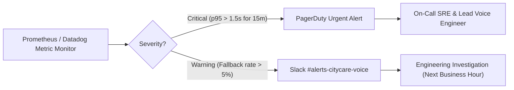

# CityCare Clinic Voice Agent — Production Alerting Rules

## Overview
This document defines the enterprise monitoring and alerting rules for the CityCare Clinic Voice AI Agent in production to safeguard conversational SLAs and patient experience.

---

## 1. Primary SLA Alert Rule: High p95 End-to-End Latency

### Objective
Alert engineering and on-call teams if the 95th percentile ($p95$) of end-to-end conversation turn latency exceeds `1.5 seconds` continuously for `15 minutes`.

```yaml
groups:
  - name: citycare_voice_agent_alerts
    rules:
      - alert: HighVoiceAgentP95Latency
        expr: histogram_quantile(0.95, sum(rate(livekit_agent_e2e_latency_seconds_bucket[5m])) by (le, agent_name)) > 1.5
        for: 15m
        labels:
          severity: critical
          service: citycare-voice-agent
          tier: production
        annotations:
          summary: "CityCare Voice Agent p95 latency exceeded 1.5s for 15m"
          description: "Agent {{ $labels.agent_name }} is experiencing p95 E2E latency of {{ $value }}s over the last 15 minutes. This breaches conversational voice SLAs."
          runbook_url: "https://ops.citycare.internal/runbooks/voice-agent-latency"
          dashboard_url: "https://grafana.citycare.internal/d/voice-agent-overview"
```

---

## 2. Supporting Production Alert Rules

### Alert 2: Model Fallback Adapter Activation Rate
- **Condition:** More than 5% of LLM calls fail over to secondary adapter within 5 minutes.
- **PromQL:**
  ```promql
  sum(rate(livekit_agent_llm_fallback_invocations_total[5m])) / sum(rate(livekit_agent_llm_requests_total[5m])) > 0.05
  ```
- **Severity:** `Warning`
- **Notification:** `#voice-ai-devs` Slack channel.

### Alert 3: Backend API Error Spike
- **Condition:** FastAPI backend error rate (5xx) > 2% for 5 minutes.
- **PromQL:**
  ```promql
  sum(rate(http_requests_total{status=~"5.."}[5m])) / sum(rate(http_requests_total[5m])) > 0.02
  ```
- **Severity:** `Critical`
- **Notification:** PagerDuty On-Call Rotation.

---

## 3. Notification Routing & Escalation Policy



---

## 4. On-Call Mitigation Runbook

If `HighVoiceAgentP95Latency` fires:
1. **Inspect LiveKit Cloud Dashboard:** Verify if packet loss / media jitter is localized to a specific geographic region.
2. **Check Model Inference TTFT:** Identify whether STT (AssemblyAI), LLM (Groq), or TTS (Fish Audio) is the bottleneck in `day5/reports/`.
3. **Verify LLM Token Quotas:** Confirm Groq / OpenAI API rate limits and switch primary provider if throttling occurs.
4. **Backend Database Health:** Check `/slots` and `/appointments` query times on FastAPI.
