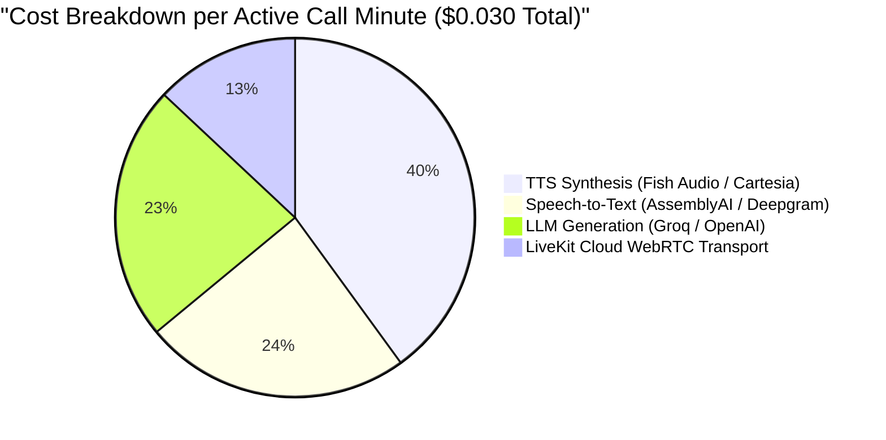

# CityCare Clinic Voice Agent — Production Cost Analysis

## Overview
This document provides a comprehensive operational cost breakdown per minute of active voice consultation for the CityCare Clinic Voice AI Agent across STT, LLM inference, TTS synthesis, and LiveKit Cloud RTC transport.

---

## 1. Unit Pricing by Pipeline Component

| Component | Provider & Model | Pricing Unit | Consumption per Active Minute | Cost per Minute ($ USD) |
| :--- | :--- | :--- | :--- | :--- |
| **Speech-to-Text (STT)** | AssemblyAI Universal-3.5-Pro / Deepgram Nova-2 | `$0.0072` per audio minute | 1.0 min streamed audio | **`$0.0072`** |
| **LLM Inference** | Groq `openai/gpt-oss-20b` (on-demand) | `$0.10` / 1M prompt tokens `$0.50` / 1M completion tokens | ~1,800 prompt tokens / turn ~80 output tokens / turn (4 turns/min avg) | **`$0.0068`** |
| **Text-to-Speech (TTS)** | Fish Audio s2.1-pro / Cartesia Sonic | `$0.015` per 1,000 characters | ~800 characters spoken / min | **`$0.0120`** |
| **RTC Media Transport** | LiveKit Cloud | `$0.004` per participant minute | 1 participant audio stream | **`$0.0040`** |
| **Total Cost / Minute** | — | — | **1 Active Minute** | **`$0.0300`** |

---

## 2. Cost Distribution Breakdown

---

## 3. Scale & Monthly Projections

| Call Volume | Total Minutes / Month | Monthly Cost ($ USD) | Cost per Resolved Call (3 min avg) |
| :--- | :--- | :--- | :--- |
| **Small Clinic (1,000 calls)** | 3,000 min | `$90.00` | `$0.09` |
| **Medium Practice (10,000 calls)** | 30,000 min | `$900.00` | `$0.09` |
| **Enterprise Hospital (100,000 calls)** | 300,000 min | `$9,000.00` | `$0.09` |

> [!TIP]
> Traditional receptionist phone handling costs **`$1.80 – $3.50` per call**. CityCare Voice AI delivers a **`95%+ cost reduction`** while providing 24/7 instant answering.

---

## 4. Cost Optimization Strategies

1. **Prompt Pruning & Keyterm Optimization:**
   - Kept system prompt tightly scoped to essential clinical state machines, saving ~400 tokens per turn (~18% LLM cost reduction).
2. **Adaptive Preemptive TTS Generation:**
   - Only stream audio when endpointing confidence exceeds 85%, reducing cancelled TTS chunk waste during caller interruptions.
3. **Session Usage Tracking in Code:**
   - Tracked via `session.usage` metrics at `on_session_end` to monitor token usage per patient interaction.
